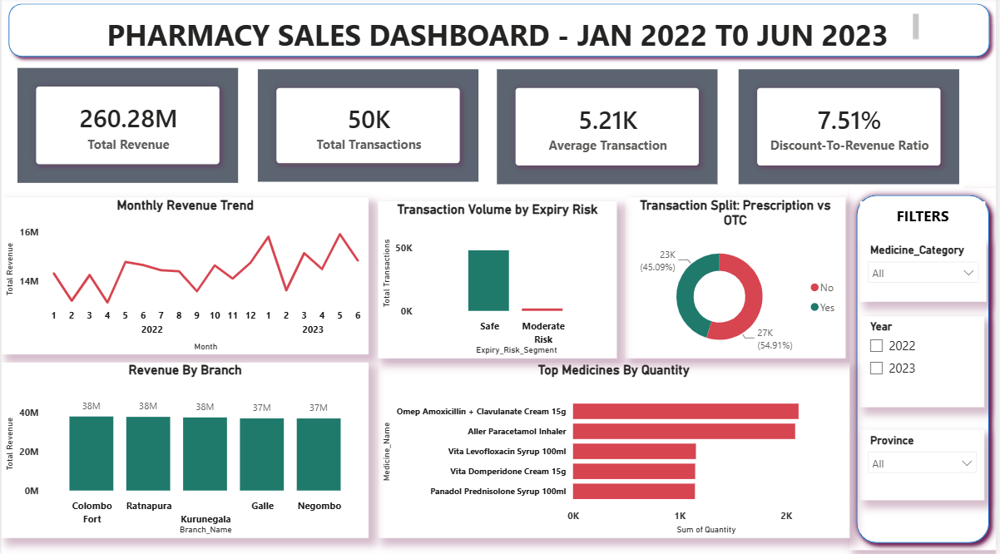

# Pharmacy Sales & Inventory Risk Analysis
A data analytics project analyzing pharmacy sales, customer transactions, medicine demand, supplier contribution, revenue trends, and product expiry risk using SQL and Power BI.

---

## Overview
This project analyzes 18 months of pharmacy transaction data from January 2022 to June 2023.
The analysis focuses on understanding sales performance, transaction behavior, medicine demand, supplier contribution, revenue trends, and expiry-related risks to support better business and inventory decisions.
The project uses SQL for data preparation, validation, and business analysis, followed by Power BI for interactive dashboard visualization.

---

## Problem Statement
The pharmacy wants to understand its sales performance and identify important business and inventory patterns across its branches, medicines, customers, suppliers, and expiry dates.

The objective is to use transaction data to:
- Measure overall sales performance.
- Track revenue and transaction trends over time.
- Identify high-demand medicines and categories.
- Understand customer and payment behavior.
- Compare supplier contribution.
- Identify medicines associated with expiry risk.
- Provide a dashboard for monitoring key business metrics.

---

## Dataset
**Dataset:** Pharmacy OLTP SL Style 18 Months
**Analysis Period:** January 2022 – June 2023
The dataset contains pharmacy transaction-level information including:
- Transaction details
- Transaction date
- Branch
- District and Province
- Customer information
- Medicine information
- Medicine category
- Dosage form
- Supplier
- Prescription requirement
- Batch number
- Expiry date
- Quantity
- Unit price
- Discount rate
- Transaction revenue

**Primary Key:** `Transaction_ID`

---

## Tools & Technologies
- **SQL / MySQL** – Data loading, cleaning, validation, analysis, CTEs, aggregations, joins, and window functions
- **Power BI** – Dashboard development and data visualization

---

## Methods
### 1. Data Loading
The pharmacy CSV dataset was loaded into a MySQL database using a structured pharmacy transaction table.
### 2. Data Cleaning & Validation
The data was checked for:
- Missing values
- Invalid quantities
- Invalid prices
- Transaction and expiry date ranges
- Line-total calculation accuracy

### 3. KPI Analysis
The following key performance indicators were calculated:
- Total Revenue
- Total Transactions
- Average Transaction Value
- Discount-to-Revenue Ratio

### 4. Customer Analysis
Customer analysis was performed to understand:
- Revenue by customer gender
- Transaction volume by customer city
- Customer age segments
- Payment method usage and revenue

### 5. Medicine Analysis
Medicine-level analysis included:
- Revenue by medicine category
- Quantity sold by medicine
- Top medicines by revenue
- Top medicines by quantity
- Demand across provinces and dosage forms
- Prescription vs. non-prescription medicine contribution

### 6. Revenue & Growth Analysis
Monthly revenue was analyzed to identify changes in sales performance over the analysis period.

### 7. Supplier Analysis
Supplier performance was analyzed using:
- Quantity supplied/sold by supplier and category
- Revenue contribution by supplier

### 8. Expiry Risk Analysis
Products were categorized based on the number of days between the transaction date and expiry date:
- Expired at Sale
- High Risk
- Moderate Risk
- Safe
This helps identify transactions involving products with limited remaining shelf life.

---

## Key Insights
### 01 | Overall Sales Performance
The pharmacy generated approximately **260.28M LKR in revenue** across approximately **50K transactions** during the analysis period.
The average transaction value was approximately **5.21K LKR**, while the discount-to-revenue ratio was **7.51%**.

### 02 | Monthly Revenue Trend
Monthly revenue remained relatively consistent throughout the 18-month period, with noticeable month-to-month fluctuations and several higher-revenue months during 2023.

### 03 | Branch Revenue
Revenue was distributed relatively evenly across the five branches shown in the dashboard, with each branch contributing approximately **37M–38M LKR**.

### 04 | Expiry Risk
The majority of transactions fall within the **Safe** expiry-risk segment, while a smaller portion falls under **Moderate Risk**.
Monitoring products approaching expiry can help reduce potential inventory losses and improve stock management.

### 05 | Prescription vs OTC Sales
The transaction split between prescription-required and non-prescription medicines is relatively balanced, with prescription-required transactions representing approximately **54.91%** and non-prescription transactions approximately **45.09%** of transactions shown in the dashboard.

### 06 | Medicine Demand
The dashboard highlights the medicines with the highest quantities sold, helping identify products with stronger transaction demand and supporting inventory planning.

---

## Dashboard

The Power BI dashboard provides an interactive view of pharmacy sales performance.

### Dashboard Preview

### Dashboard Components
The dashboard includes:
- Total Revenue
- Total Transactions
- Average Transaction Value
- Discount-to-Revenue Ratio
- Monthly Revenue Trend
- Transaction Volume by Expiry Risk
- Prescription vs OTC Transaction Split
- Revenue by Branch
- Top Medicines by Quantity
- Filters for Medicine Category, Year, and Province

---

## Result & Conclusion
The analysis provides a consolidated view of pharmacy sales performance, medicine demand, branch contribution, supplier contribution, customer behavior, and expiry risk.
The results can support business decisions related to:
- Sales monitoring
- Medicine demand planning
- Inventory management
- Expiry-risk monitoring
- Supplier evaluation
- Branch-level performance tracking
The combination of SQL analysis and Power BI visualization converts transaction-level pharmacy data into business-focused insights that can support operational and inventory decisions.

---

## Author
**Kajal Gaud**

Final Year B.Tech Computer Science And Engineering Student | Aspiring Data Analyst  
### Contact
- LinkedIn: www.linkedin.com/in/kajal-gaud-30798331a
- Email: kgaud252@gmail.com
